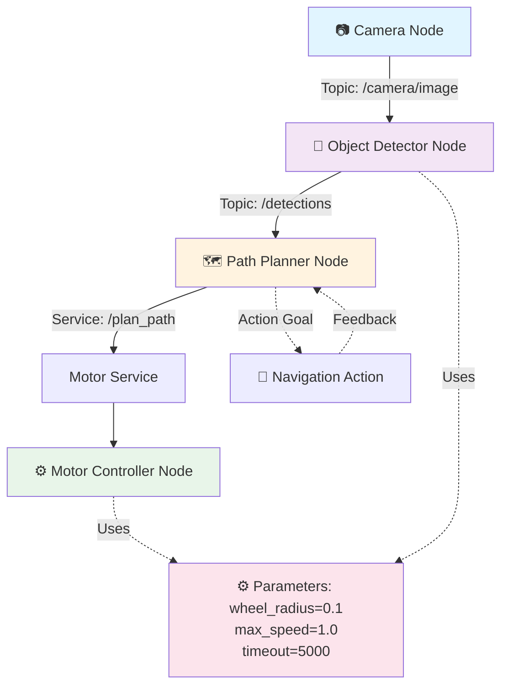

# Core Concepts & Theory

## The Five Pillars of ROS 2

ROS 2's architecture is built on five core concepts. Understanding these deeply is essential because everything else in ROS 2 builds upon them. Let's examine each one:

1. **Nodes** - The basic unit of computation
2. **Topics** - Asynchronous publish-subscribe communication
3. **Services** - Synchronous request-response communication
4. **Actions** - Long-running tasks with feedback
5. **Parameters** - Configuration values shared across nodes

Let's dive into each.

---

## 1. Nodes: The Basic Building Block

### What is a Node?

A **node** is a single, independently running program that performs a specific computational task. In ROS 2 terminology, we often call it "a process that performs computation."

Think of nodes as specialized workers in a factory:
- One worker assembles parts (Motor Controller Node)
- Another inspects quality (Sensor Monitor Node)
- A third packages products (Actuator Control Node)
- They coordinate through messages, not by talking directly

### Characteristics of Nodes

**Autonomy**: Each node runs independently and can be started, stopped, or replaced without affecting others.

**Single Responsibility**: Each node should do one thing well. A node that both reads sensors AND controls motors is doing too much.

**Distributed**: Nodes can run on the same computer or distributed across a network, even across different robots.

**Language-Agnostic**: ROS 2 nodes can be written in Python, C++, Java, or other languages—they communicate through standard interfaces.

### Node Lifecycle

Every ROS 2 node follows a lifecycle:

```
┌──────────────────────────────────────────────────────┐
│           NODE LIFECYCLE STATES                      │
├──────────────────────────────────────────────────────┤
│                                                      │
│  PRIMARY:                                            │
│  ┌─ Unconfigured (initial state)                    │
│  ├─ Inactive (configured but not running)           │
│  ├─ Active (running and processing)                 │
│  └─ Finalized (shutting down)                       │
│                                                      │
│  TRANSITIONS:                                        │
│  Unconfigured ──configure──> Inactive              │
│  Inactive ──activate──> Active                      │
│  Active ──deactivate──> Inactive                    │
│  Inactive ──cleanup──> Unconfigured                 │
│                                                      │
└──────────────────────────────────────────────────────┘
```

This lifecycle is crucial for:
- ✅ Controlled startup/shutdown sequences
- ✅ Preventing race conditions
- ✅ Testing and debugging
- ✅ Multi-robot coordination

### Example: Motor Controller Node

Let's visualize a simple motor controller node:

```python
# A simple ROS 2 node that controls a motor
from rclpy import Node

class MotorControllerNode(Node):
    def __init__(self):
        super().__init__('motor_controller')
        self.get_logger().info('Motor Controller Node started')

    def run(self):
        # This node processes motor commands
        # It subscribes to commands and publishes status
        pass
```

---

## 2. Topics: Asynchronous Communication

### What is a Topic?

A **topic** is a named communication channel for asynchronous message passing. It implements the **publish-subscribe pattern**:

- **Publishers** send messages to a topic
- **Subscribers** receive messages from the topic
- No direct connection between publisher and subscriber
- Messages are fire-and-forget (asynchronous)

### Publisher-Subscriber Model

```
PUBLISHER         TOPIC         SUBSCRIBER
────────────      ─────         ──────────
   |                |               |
   │ publishes msg  │               │
   └────────────────>               │
                    │               │
                    │ message queue │
                    │               │
                    │──────message─→│
                    │    callback   │
```

### Topic Naming Convention

Topics use hierarchical names separated by `/`:

- `/motor/left_wheel` - Command for left motor
- `/sensor/imu/acceleration` - IMU acceleration data
- `/robot/status/battery_level` - Battery status
- `/perception/camera/rgb` - RGB camera feed

### Message Types

Messages published on a topic have a specific type that defines the data structure:

```python
# Example: geometry_msgs.Twist (velocity commands)
{
    linear: {
        x: 0.5,      # forward speed (m/s)
        y: 0.0,      # lateral speed
        z: 0.0       # vertical speed
    },
    angular: {
        x: 0.0,      # roll rate
        y: 0.0,      # pitch rate
        z: 0.2       # yaw rate (rad/s)
    }
}
```

### QoS (Quality of Service)

ROS 2 allows you to specify how messages should be handled:

| QoS Setting | Meaning | Use Case |
|---|---|---|
| **Reliability** | Guaranteed or Best-Effort delivery | Guaranteed for critical commands, Best-Effort for sensor streams |
| **Durability** | Transient or Volatile messages | Transient for latecomer nodes, Volatile for real-time data |
| **History** | Keep all or last N messages | Keep last 10 for buffering |
| **Deadline** | Message must arrive within X milliseconds | Real-time systems |

Example:
```python
# Strict QoS for motor commands (must not be lost)
publisher = node.create_publisher(
    Twist,
    '/cmd_vel',
    qos_profile=QoSProfile(
        reliability=ReliabilityPolicy.RELIABLE,
        durability=DurabilityPolicy.TRANSIENT_LOCAL
    )
)
```

### Topic Use Cases

✅ **Sensor Data Streams**: Camera frames, IMU readings, lidar scans (high-frequency, ok to lose some)
✅ **Status Updates**: Battery level, temperature, operational state (moderate frequency)
✅ **Visualization**: Visualization markers, debug data for monitoring
✅ **Real-Time Control**: Motor speeds, joint velocities (must be up-to-date)

---

## 3. Services: Synchronous Communication

### What is a Service?

A **service** is a synchronous request-response communication pattern. Unlike topics (one-way), services establish a two-way communication:

- **Client** sends a request and waits for a response
- **Server** receives request, processes it, and sends back a response
- Blocking: The client waits (unlike topics which are non-blocking)

### Service Call Model

```
CLIENT              SERVICE             SERVER
──────              ───────             ──────
   |                                       |
   │ request                              │
   │────────────────────────────────────>│
   │                                      │
   │        (processing)                  │
   │                                      │
   │ response                             │
   │<────────────────────────────────────│
   |
```

### Service Definition

Services have a request and response structure:

```python
# Example: Image capture service
# Request: Specify which camera (left, right, center)
# Response: The captured image
Request:
  camera_id: int  # 0=left, 1=right, 2=center

Response:
  image: Image    # The captured image
  success: bool   # Whether capture succeeded
```

### When to Use Services vs Topics

| Aspect | Topic (Pub-Sub) | Service (Request-Response) |
|--------|---|---|
| **Timing** | Asynchronous | Synchronous (blocking) |
| **Data Flow** | One-way | Two-way |
| **Use Case** | Continuous data streams | Computation requests |
| **Frequency** | High frequency possible | Lower frequency |
| **Example** | Sensor readings | Object detection request |

**Rule of Thumb**:
- Use **topics** for continuous streams (sensor data)
- Use **services** for on-demand computation (detection, planning)

### Service Examples

```python
# Service 1: Get the current joint positions
Service: /get_joint_state
Request: {joint_names: ["shoulder", "elbow", "wrist"]}
Response: {positions: [0.5, 1.2, -0.3]}

# Service 2: Compute path to target
Service: /plan_path
Request: {start: Pose, goal: Pose}
Response: {path: [Pose1, Pose2, Pose3, ...]}

# Service 3: Enable/disable motor safety
Service: /motor_safety
Request: {enabled: bool}
Response: {success: bool}
```

---

## 4. Actions: Long-Running Tasks

### What is an Action?

An **action** is a communication pattern for long-running tasks that need:
- ✅ Progress feedback (intermediate information)
- ✅ Cancellation capability (stop the task mid-way)
- ✅ Asynchronous execution (don't block the caller)

Actions combine benefits of both topics and services:
- Like services: Request → Response
- Like topics: Feedback during execution

### Action Structure

```
CLIENT                          ACTION SERVER
──────                          ─────────────
   |                                 |
   │ Goal: "Go to target (x, y)"    │
   │────────────────────────────────>│
   │                                 │
   │ [Action executing...]           │
   │                                 │
   │ Feedback: "50% complete"        │
   │<────────────────────────────────│
   │                                 │
   │ Feedback: "75% complete"        │
   │<────────────────────────────────│
   │                                 │
   │ Result: "Reached target"        │
   │<────────────────────────────────│
   |
```

### Action Use Cases

✅ **Navigation**: "Go to this waypoint" (provides continuous feedback like "90% complete")
✅ **Manipulation**: "Reach for this object" (can be cancelled if object moves)
✅ **Learning**: "Learn from this dataset" (provides progress updates)
✅ **Any long-running task** that needs feedback and cancellation

### Action Example

```python
# Action: Navigate to position
class NavigateToPosition:
    # Client sends this goal
    Goal:
        target_x: float
        target_y: float
        target_z: float

    # Server provides feedback during execution
    Feedback:
        current_distance: float  # Distance remaining
        estimated_time: float    # ETA in seconds

    # Client receives this result
    Result:
        success: bool
        final_position: Position
```

---

## 5. Parameters: Configuration Values

### What are Parameters?

**Parameters** are configuration values shared across the ROS 2 system. They're like global variables, but with proper scope and lifecycle management.

Common parameters:
- Sensor calibration values
- PID tuning gains
- Safety thresholds
- Robot physical dimensions
- Communication timeouts

### Parameter Access

```python
# Set a parameter
node.declare_parameter('wheel_radius', 0.1)  # 10cm wheels
node.set_parameters([Parameter('wheel_radius', Parameter.Type.DOUBLE, 0.1)])

# Get a parameter
radius = node.get_parameter('wheel_radius').value

# Listen for parameter changes
node.add_on_set_parameters_callback(on_parameters_changed)
```

### Parameter Organization

Parameters are organized hierarchically:

```
/robot
  /differential_drive
    /wheel_radius: 0.1
    /track_width: 0.5
    /max_speed: 1.0
  /safety
    /collision_threshold: 0.3
    /timeout_ms: 5000
```

---

## System Architecture Diagram

Here's how all five concepts work together:



---

## Communication Pattern Decision Tree

When designing a ROS 2 system, use this tree to decide which communication pattern to use:

```
Is this continuous data streaming?
├─ YES → Use TOPIC (pub-sub)
│        (sensor data, status updates, visualization)
│
└─ NO → Is this a request that needs a response?
        ├─ YES → Does it take a long time?
        │         ├─ YES → Use ACTION
        │         │        (navigation, manipulation, long tasks)
        │         │
        │         └─ NO → Use SERVICE
        │                 (computation, configuration)
        │
        └─ NO → Is this a configuration value?
                └─ YES → Use PARAMETER
                         (calibration, tuning, settings)
```

---

## Building Blocks of a Complete System

Now that you understand the five core concepts, here's how they combine to build a real system:

### Example: Robotic Arm Control System

```
1. NODES:
   - Sensor Reader Node (publishes joint angles)
   - Motion Planner Node (plans safe trajectories)
   - Motor Control Node (drives actuators)
   - Safety Monitor Node (checks for collisions)

2. TOPICS:
   - /joint_states (sensor → planner, motor)
   - /collision_alerts (safety → planner, motor)
   - /motor_commands (planner → motor)

3. SERVICES:
   - /plan_trajectory (motor calls planner)
   - /enable_safety (motor calls safety)
   - /get_forward_kinematics (planner calls sensor)

4. ACTIONS:
   - /grasp_object (motion goal, position feedback, result)

5. PARAMETERS:
   - /arm/joint_limits
   - /arm/speed_limits
   - /safety/collision_distance_threshold
```

---

## The Middleware: DDS

Underneath all these concepts is **DDS (Data Distribution Service)**, a standardized middleware that provides:

- ✅ **Discovery**: Nodes find each other automatically
- ✅ **Routing**: Messages get delivered reliably
- ✅ **QoS**: Configurable reliability and timing guarantees
- ✅ **Network**: Can run over UDP (fast), TCP (reliable), or shared memory
- ✅ **Scalability**: Handles hundreds of nodes efficiently

You don't usually interact with DDS directly—ROS 2 abstracts it away. But understanding that it's underneath explains why ROS 2 is so powerful.

---

## Summary: The Five Concepts

| Concept | Pattern | Use Case | Example |
|---------|---------|----------|---------|
| **Nodes** | Independent process | Any computational task | Motor controller |
| **Topics** | Pub-Sub (async) | Continuous data | Sensor streams |
| **Services** | Request-Response (sync) | On-demand computation | Image capture |
| **Actions** | Long-running tasks | Extended operations | Navigation |
| **Parameters** | Configuration values | System settings | Calibration |

Master these five concepts, and you understand the core of ROS 2.

---

**Next Section**: Hands-On Tutorial
**Time to Read**: 30-40 minutes
**Difficulty**: Moderate (lots of new terminology, but clear concepts)

---

## Key Takeaways

- ✅ **Nodes** are independent programs; ROS systems are graphs of nodes
- ✅ **Topics** are streams; use for continuous data (topics are async)
- ✅ **Services** are functions; use for on-demand computation (services are sync)
- ✅ **Actions** are tasks; use for long-running operations with feedback
- ✅ **Parameters** are settings; use for configuration and tuning
- ✅ **DDS** is the underlying middleware making it all work
