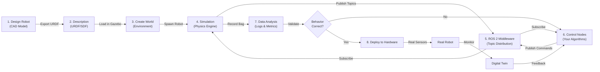

# Core Concepts: Gazebo, Digital Twins & Sensor Simulation

## 1. Gazebo Architecture: How It All Works

Gazebo is a **physics simulation engine** combined with a **rendering engine**. Let's break down the components:

### Core Components

```
Gazebo Instance
├── Server (gzserver)
│   ├── Physics Engine (Bullet, ODE, DART)
│   ├── Sensor Simulation Plugin
│   ├── World State Management
│   └── ROS 2 Plugin Bridge
│
├── Client (gzclient)
│   ├── OpenGL Renderer
│   ├── Visualization
│   └── User Interface
│
└── Plugins
    ├── Robot State Publisher
    ├── Joint Controller
    ├── Camera Simulator
    ├── LiDAR Simulator
    └── Force/Torque Sensor Simulator
```

### Key Concepts

**Worlds**: Container for simulation
- Defines gravity, physics parameters, lighting
- Holds all models and objects
- Can save/load complete snapshots
- Example: `warehouse_world.sdf`, `apartment_world.sdf`

**Models**: Entities in the simulation
- Robot (movable with actuators)
- Static object (shelf, table, wall)
- Sensor (camera, LiDAR)
- Can be nested (gripper is part of arm, arm is part of robot)

**Links**: Rigid bodies
- Defined by: geometry, mass, inertia tensor
- Physical properties: friction, restitution
- Cannot pass through each other

**Joints**: Connections between links
- Revolute (rotational like door hinge)
- Prismatic (linear like piston)
- Fixed (no movement)
- Each joint has dynamics: friction, spring constant, damping

**Sensors**: Perception devices
- Virtual cameras, LiDAR, IMU, force/torque
- Output data via ROS 2 topics
- Subject to simulated noise and latency

---

## 2. Robot Models: URDF & SDF

Robots are described using standardized formats.

### URDF (Unified Robot Description Format)

**What it is**: XML-based description of robot structure

**Contains**:
- Link definitions (mass, geometry, inertia)
- Joint definitions (parent, child, limits, dynamics)
- Visual elements (3D mesh for rendering)
- Collision elements (simplified geometry for physics)

**Example URDF snippet** (2-DOF robotic arm):
```xml
<?xml version="1.0"?>
<robot name="simple_arm">
  <!-- Base link -->
  <link name="base_link">
    <inertial>
      <mass value="2.0"/>
      <inertia ixx="0.05" ixy="0" ixz="0"
               iyy="0.05" iyz="0" izz="0.05"/>
    </inertial>
    <visual>
      <geometry>
        <box size="0.1 0.1 0.05"/>
      </geometry>
    </visual>
    <collision>
      <geometry>
        <box size="0.1 0.1 0.05"/>
      </geometry>
    </collision>
  </link>

  <!-- Shoulder joint -->
  <joint name="shoulder_joint" type="revolute">
    <parent link="base_link"/>
    <child link="upper_arm"/>
    <axis xyz="0 0 1"/>
    <limit lower="0" upper="3.14" effort="100" velocity="1.0"/>
  </joint>

  <!-- Upper arm link -->
  <link name="upper_arm">
    <inertial>
      <mass value="1.5"/>
    </inertial>
    <visual>
      <geometry>
        <cylinder radius="0.02" length="0.3"/>
      </geometry>
    </visual>
  </link>
</robot>
```

**Why URDF?**
- Universal standard (ROS, Gazebo, RVIZ all understand it)
- Human-readable XML format
- Easy to version control
- Can be generated from CAD tools

### SDF (Simulation Description Format)

**What it is**: Extended version of URDF, Gazebo-native

**Why SDF over URDF?**
- More detailed physics parameters
- Better for complex simulations
- Supports complex sensor definitions
- Plugin configuration

**Example difference**: URDF can describe a motor's max torque, but SDF can define the motor's acceleration curve, current draw, and thermal model.

---

## 3. Physics Simulation: How the Virtual World Works

The physics engine is the "brain" of simulation. It solves:

### Newton's Laws in Software

For every object in the world, the physics engine computes:
1. **Forces** acting on it (gravity, collisions, actuators)
2. **Acceleration** from F = ma
3. **Velocity** by integrating acceleration
4. **Position** by integrating velocity

This happens **many times per second** (typically 1000 Hz):

```
Update Loop (1000 Hz):
1. Apply forces (gravity, motors, contacts)
2. Detect collisions
3. Resolve collisions (prevent penetration)
4. Compute accelerations
5. Update velocities
6. Update positions
7. Update sensor readings
```

### Collision Detection & Response

**Collision detection**: Which objects are touching?
- Bounding box checks (fast, rough)
- Mesh-based checks (slow, accurate)
- Gazebo uses both (fast pre-check, then detailed)

**Collision response**: What happens when objects touch?
- Compute contact point
- Compute normal force (prevent penetration)
- Apply friction forces
- Transfer momentum

**Parameters affecting collisions**:
- Friction coefficient (0=ice, 1=rubber)
- Restitution (0=soft, 1=bouncy)
- Surface material properties

---

## 4. Sensor Simulation: Creating Virtual Perception

This is crucial for physical AI: sensors in simulation must approximate reality.

### Camera Simulation

**What happens**:
1. Define virtual camera with:
   - Position in world
   - Field of view (horizontal, vertical)
   - Resolution (640x480 pixels typical)
   - Intrinsic parameters (focal length, principal point)

2. Gazebo renders the 3D world from camera's viewpoint
   - Uses OpenGL for rendering
   - Applies texture and lighting
   - Outputs RGB image

3. Optional: Add simulated effects
   - Gaussian blur (lens imperfection)
   - Noise (photographic noise)
   - Lens distortion
   - Motion blur

**Output**: Published to ROS 2 topic `/camera/image_raw` as `sensor_msgs/msg/Image`

**Code example** (sensor configuration in SDF):
```xml
<sensor name="camera" type="camera">
  <pose>0 0 0.5 0 0 0</pose>
  <camera>
    <image>
      <width>640</width>
      <height>480</height>
      <format>R8G8B8</format>
    </image>
    <clip>
      <near>0.05</near>
      <far>100</far>
    </clip>
  </camera>
  <always_on>true</always_on>
  <update_rate>30</update_rate>
</sensor>
```

### LiDAR Simulation

**What it is**: Virtual laser scanning

**How it works**:
1. Emit 100+ rays in different directions
2. For each ray, raycast into the 3D world
3. Find nearest object intersection
4. Return distance and intensity

**Challenge**: LiDAR has unique artifacts:
- Blind spots behind objects
- Noise that increases with distance
- Multi-path reflections (rays bouncing)
- Specular reflections (shiny surfaces)

**Output**: Published as `sensor_msgs/msg/LaserScan` or `sensor_msgs/msg/PointCloud2`

### IMU Simulation

**What it measures**:
- Linear acceleration (x, y, z)
- Angular velocity (roll, pitch, yaw rates)

**Simulation approach**:
1. Compute robot body's current acceleration from physics engine
2. Compute angular velocity from orientation changes
3. Add noise (gravity bias, temperature drift)
4. Output

**Realism factors**:
- Accelerometer bias (DC offset)
- Gyroscope drift (error that grows over time)
- Noise properties (white noise, colored noise)
- Saturation (max measurable acceleration)

### Force/Torque Sensor Simulation

**Measures**: Interaction forces when grasping objects

**Simulation**:
1. Compute contact forces at gripper-object interface
2. Convert forces to local frame
3. Add sensor noise

**Key realism**: Response lag (real F/T sensors have ~50-100ms latency)

---

## 5. Digital Twins: Simulation Beyond Physics

A **digital twin** is more than just physics simulation. It's a **continuous, bidirectional connection** between real and virtual.

### Architecture of a Digital Twin

```
┌─────────────────────────────────────────────────┐
│           Digital Twin System                    │
├─────────────────────────────────────────────────┤
│                                                  │
│  ┌──────────────────────┐  ┌──────────────────┐│
│  │    Virtual Robot     │  │   Real Robot     ││
│  │   (in Gazebo)        │  │  (in warehouse)  ││
│  │                      │  │                  ││
│  │  • Joint angles      │  │  • Joint angles  ││
│  │  • Velocity          │  │  • Velocity      ││
│  │  • Sensor readings   │  │  • Sensor data   ││
│  └──────────────────────┘  └──────────────────┘│
│           ▲                         ▼            │
│           │    State Sync           │            │
│           │    (ROS 2 topics)       │            │
│           └─────────────────────────┘            │
│                                                  │
│  ┌────────────────────────────────────────────┐ │
│  │  Central Repository (time-series DB)        │ │
│  │  • Stores all sensor history                │ │
│  │  • Records decisions and actions            │ │
│  │  • Maintains state timeline                 │ │
│  └────────────────────────────────────────────┘ │
│                                                  │
│  ┌────────────────────────────────────────────┐ │
│  │  Anomaly Detection & Analysis               │ │
│  │  • Compare sim vs real behavior             │ │
│  │  • Detect failures early                    │ │
│  │  • Retrain models from divergences          │ │
│  └────────────────────────────────────────────┘ │
│                                                  │
└─────────────────────────────────────────────────┘
```

### Key Difference: Simulation vs. Digital Twin

| Aspect | Simulation | Digital Twin |
|--------|-----------|--------------|
| **Direction** | One-way (computer → results) | Bi-directional (real ↔ virtual) |
| **Update** | Offline (when you run it) | Real-time (continuous) |
| **Purpose** | Test algorithms | Monitor & predict real system |
| **Data flow** | Input only | Input and feedback |
| **Use case** | Development | Production monitoring |

### Digital Twin Use Cases

**Predictive Maintenance**:
- Monitor real robot's sensor data continuously
- Feed to simulated twin
- If twin and real diverge, something's failing
- Alert before catastrophic failure

**Example**: A humanoid robot's accelerometer suddenly shows bias shift:
1. Virtual twin reproduces with old parameters
2. Update virtual twin's calibration
3. "Virtual robot" predicts failure in 2 weeks
4. Schedule maintenance before failure

**Behavior Validation**:
- Confirm real robot follows same trajectory as planned in simulation
- Detect when real robot deviates (obstacle, actuator failure, slip)
- Trigger fallback behaviors

**Continuous Learning**:
- Collect real-world sensor data
- Run in simulation for analysis
- Retrain models with real-world examples
- Deploy improved models to real robot

---

## 6. The Simulation Pipeline: From Design to Deployment

Here's the complete workflow:



### Pipeline Stages

**Stage 1-3: Preparation** (offline)
- Design robot (CAD)
- Export URDF/SDF description
- Create simulation world with obstacles, lights, etc.

**Stage 4-6: Simulation** (real-time)
- Physics engine simulates 1000 times/sec
- Sensors output data at specified rates (e.g., 30 Hz for camera)
- ROS 2 distributes sensor data to your control nodes
- Your nodes send commands back

**Stage 7: Analysis** (offline)
- Record all topics (rosbag)
- Analyze recorded data offline
- Validate behavior matches expectations
- Debug any issues

**Stage 8+: Hardware** (deployment)
- Deploy same ROS 2 nodes to real robot
- Real sensors replace simulated ones
- Digital twin monitors real robot
- Continuous validation and improvement

---

## 7. Key Simulation Parameters to Understand

When setting up a simulation, you'll encounter these critical parameters:

### Physics Parameters

**Gravity** (default: 9.81 m/s² downward)
- Can be disabled for space robots or flying robots
- Affects contact forces and joint torque requirements

**Physics step size** (default: 0.001s = 1 kHz)
- Smaller = more accurate but slower
- Larger = faster but less stable
- Rule of thumb: 10-100x faster than control loop

**Solver iterations** (default: 50)
- More iterations = better accuracy
- Diminishing returns beyond 100

**Friction coefficient**
- 0 = frictionless (ice)
- 0.5 = normal (concrete)
- 1.0+ = high friction (rubber on rubber)

### Sensor Parameters

**Update rate** (Hz)
- 30 Hz for camera (matches typical hardware)
- 100 Hz for LiDAR
- 100-200 Hz for IMU

**Noise properties**
- Gaussian noise (normal distribution)
- Bias (DC offset that drifts)
- Saturation (max value sensor can measure)

**Latency**
- Simulated sensor might output delayed readings
- Matches real sensor lag time

### Control Parameters

**Joint effort limits**
- Maximum torque motor can apply
- Should match real actuator spec

**Joint velocity limits**
- Maximum angular velocity
- Determines responsiveness

**PID controller gains** (if using Gazebo controller)
- P: Proportional (immediate response)
- I: Integral (steady-state correction)
- D: Derivative (damping)

---

## 8. Common Simulation Challenges

### Challenge 1: Physics Instability

**Problem**: Robot vibrates, flies apart, or sinks through ground

**Causes**:
- Physics timestep too large
- Contact friction too high
- Joint damping too low

**Solution**:
- Reduce timestep from 0.001 to 0.0001
- Lower friction coefficient
- Increase joint damping

### Challenge 2: Sim-to-Real Discrepancy

**Problem**: Works perfectly in simulation, fails on real hardware

**Causes**:
- Simulation is too simplified
- Real actuators have lag
- Real sensors have noise
- Friction model incorrect

**Solution**:
- Add noise to simulation
- Model actuator dynamics
- Test on real hardware early and often
- Use domain randomization

### Challenge 3: Performance (Slow Simulation)

**Problem**: Simulation runs slower than real-time

**Causes**:
- Too many collision checks
- Complex mesh geometries
- Too many sensor plugins
- Low GPU performance

**Solution**:
- Simplify collision meshes
- Reduce sensor update rates
- Use primitive geometries where possible
- Run on dedicated GPU machine

### Challenge 4: Sensor Accuracy

**Problem**: Simulated camera doesn't match real camera output

**Causes**:
- Wrong focal length (intrinsics)
- Missing lens distortion
- Camera pose not calibrated
- Lighting not realistic

**Solution**:
- Calibrate virtual camera using real camera data
- Add lens distortion plugins
- Tune lighting to match environment
- Use photorealistic rendering (Isaac Sim)

---

## 9. Connecting Gazebo to ROS 2

This is the **key integration point**:

### Gazebo ROS 2 Plugin

The **gazebo_ros2_control** plugin:
1. Reads joint commands from ROS 2 topics
2. Applies forces to joints in simulation
3. Publishes joint states back to ROS 2
4. Bridges ROS 2 and Gazebo seamlessly

### Default ROS 2 Topics from Gazebo

```
Publisher (Gazebo → ROS 2):
- /robot_state_publisher/description (URDF)
- /joint_states (sensor_msgs/msg/JointState)
- /tf (geometry_msgs/msg/TransformStamped) - transform tree
- /tf_static (static transforms)
- /camera/image_raw (sensor_msgs/msg/Image)
- /lidar/scan (sensor_msgs/msg/LaserScan)
- /imu/data (sensor_msgs/msg/Imu)

Subscriber (ROS 2 → Gazebo):
- /cmd_vel (geometry_msgs/msg/Twist) - velocity commands
- /joint_trajectory_controller/follow_trajectory_action - trajectory goals
```

### Example: Your Code Receives Simulated Data

```python
# Module 1 subscriber code - unchanged!
def sensor_callback(self, msg):
    # This could be real camera or Gazebo camera
    # Node doesn't know the difference!
    process_image(msg.data)
```

The **same code** works with:
- Real USB camera (driver publishes to `/camera/image_raw`)
- Simulated Gazebo camera (gazebo_ros plugin publishes to `/camera/image_raw`)
- USB camera from file playback (rosbag playback publishes to topic)

---

## Summary of Key Concepts

| Concept | What | Why |
|---------|------|-----|
| **Gazebo** | Physics + rendering engine | Simulate robots and sensors |
| **URDF** | Robot description format | Define robot structure |
| **World** | Simulation environment | Place robots and obstacles |
| **Physics Engine** | Solves F=ma 1000x/sec | Realistic motion |
| **Sensors** | Virtual cameras, LiDAR, IMU | Simulate perception |
| **Digital Twin** | Real ↔ Virtual connection | Monitor and optimize real systems |
| **ROS 2 Plugin** | Gazebo ↔ ROS 2 bridge | Seamless data flow |

---

**Next Section**: Hands-On Tutorial - Set Up and Run Your First Gazebo Simulation
**Time to Read**: 90 minutes
**Estimated Hands-On Time**: 2-3 hours

---

*Last Updated: 2026-01-20*
*Module Version: 1.0*
